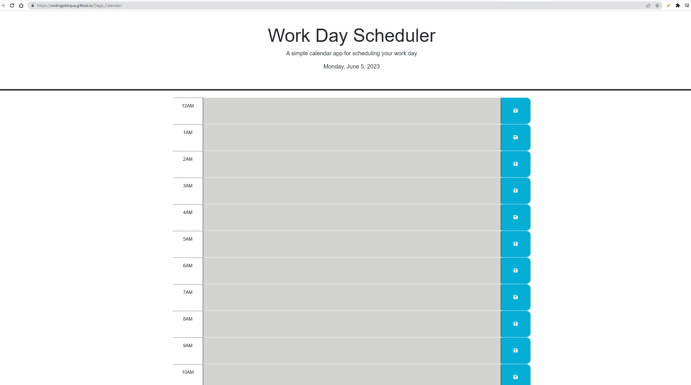

# DayJs2

## Description

The DayJs2 is a web application that provides a user-friendly daily planner to help you organize your schedule effectively. It offers the following features:

Displays the current day at the top of the calendar when opened.
Presents time blocks for standard business hours (9am to 5pm) as you scroll down.
Color-codes each time block to indicate whether it is in the past, present, or future.
Allows you to enter events by clicking into a time block.
Saves the entered event text in local storage when you click the save button.
Persists the saved events even when you refresh the page.
Example page

 https://codingobliqua.github.io/DayJs2/

## Installation

To install and run the Dayjs2 project locally, follow these steps:

Clone the repository from GitHub: git clone 
Navigate to the project directory: cd DayJs2
Open the index.html file in a web browser.
## Usage
Once you have the DayJs2 running, you can start using it to plan your day:

The current day will be displayed at the top of the calendar.
Scroll down to view the time blocks for standard business hours.
Each time block will be color-coded to indicate whether it is in the past, present, or future.
To add an event, click into a time block and enter the event text.
Click the save button for that time block to save the event in local storage.
Even if you refresh the page, your saved events will persist.

